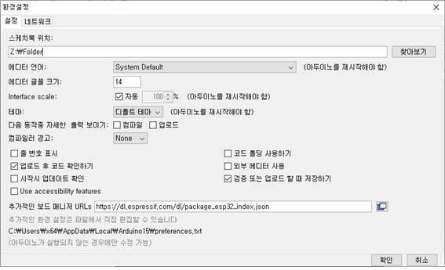

## ESP32
---------------------------------

> 설치   

메뉴에서 File → Preference를 실행하고 Additional Boards Manager URLs 항목에 다음을 추가한다.  
https://raw.githubusercontent.com/espressif/arduino-esp32/gh-pages/package_esp32_index.json   

   
